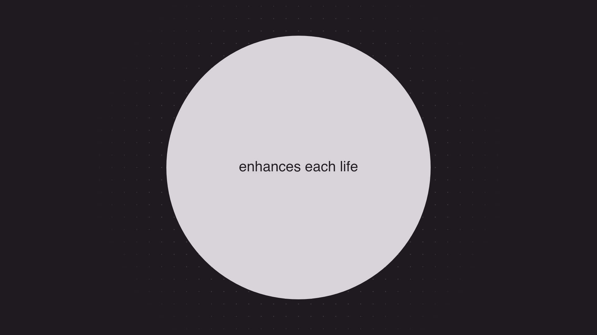

# Apple Intention

将 *Designed by Apple — Intention* 参考影片中的文字、圆点、细线与黑白转场，重建为鼠标滚动驱动的单页。这个仓库同时保留原始提示词、执行文档、参考视频与精选画面，记录从分析到实现、再到发布的过程。

[在线体验](https://yalin28.github.io/apple-intention/) · [执行文档](docs/EXECUTION_PLAN.md) · [参考素材索引](reference/README.md) · [绘图预览说明](docs/previews/README.md)



> 上图是应用绘图代码生成的本地预览，不是浏览器截图。浏览器交互效果与实际帧率尚未实测。

## 实现内容

- 单个 `index.html`，内联业务 JavaScript、CSS、SVG 与绘图数据，无构建工具或后端。
- 使用 **Lenis 1.3.26 + GSAP 3.13.0 + ScrollTrigger 3.13.0**，从固定版本 CDN 加载。
- 20 个连续场景，一条可逆主时间轴，约 31 个视口高度的滚动距离；按文字阅读和动作节奏分配各段长度。
- DOM 呈现文字，SVG 绘制开场线框，Canvas 2D 处理粒子、连线及圆形转场。
- 粒子使用固定种子及绝对时间求值，支持正向、反向与跳转；统一由 GSAP ticker 驱动，Canvas 像素预算约 520 万。
- 保留完整英文稿，支持减少动态偏好、强制颜色模式和依赖加载失败时的静态回退。
- 不播放参考视频，不处理音频。影片仅作开发参考，不是网页运行依赖。

保留了文字放大并散为粒子、相交双圆的浅色透镜、放射线收束、黑圆扩张，以及结尾白圆的两轮缩放等主要动作。字体、细线轨迹和背景粒子是依据参考画面制作的近似，未宣称逐像素还原。片头空白被压缩，片尾黑帧被省略，最终停在落款。

## 本地运行

克隆仓库后，联网直接打开根目录的 `index.html` 即可。也可以用任意静态服务器，例如：

```bash
git clone https://github.com/yalin28/apple-intention.git
cd apple-intention
python3 -m http.server 8000
```

然后访问 [localhost:8000](http://localhost:8000)。向下滚动推进，向上滚动回退，停止滚动后画面随短暂惯性收敛。没有滚动吸附或强制整屏翻页。

应用文件只有一个，但默认仍需联网加载三个动画库。参考素材无需加载到页面中。

## 仓库结构

```text
apple-intention/
├── index.html                         # 单文件应用
├── README.md                          # 项目说明与原始提示词
├── .github/workflows/pages.yml        # GitHub Pages 发布
├── docs/
│   ├── EXECUTION_PLAN.md              # 分镜、实施与断点交接记录
│   ├── asset-manifest.json            # 素材路径、时间码、尺寸与 SHA-256
│   └── previews/
│       ├── README.md                 # 预览生成方式与验证边界
│       ├── frames/                   # 8 张精选网页绘图预览
│       └── contact-sheets/           # 2 张最终绘图联系表
└── reference/
    ├── README.md                     # 参考素材说明与索引
    ├── video/                        # 原始 MP4
    ├── frames/                       # 24 张精选视频参考帧
    └── contact-sheets/                # 4 张全片总览 + 8 张转场细览
```

根据归档时的选择，只保留联系表和精选关键帧，共 **46 张图片**。视频与图片合计约 **14.55 MiB**；没有提交全部逐帧提取文件、下载的第三方库、临时脚本或模块缓存。

独立画面采用 `078.000s-enhances-life.png` 这样的名称：前三位为秒数，小数部分为毫秒，后缀描述画面。网页绘图预览的时间码表示对应的**参考影片时间**，不代表浏览器滚动位置或实际播放时间。

## 原始提示词

下面只记录本次项目的用户任务提示词与关键选择，不包含运行环境、账户信息或全局代理指令。第一条中的原始附件现归档于 [`reference/video/designed-by-apple-intention-1080p.mp4`](reference/video/designed-by-apple-intention-1080p.mp4)。

### 1. 先分析视频，输出执行文档

```text
根据 [designed_by_apple_-_intention (1080p).mp4] 视频，用 Lenis + GSAP + ScrollTrigger 实现鼠标滚动驱动的单网页（单个.html文件），让网页的交互和视频一致。做到合理的滚动触发，让交互丝滑性能优异，不用处理音频。

先整体梳理输出一个md 执行文档，方便后续我token不够任务中断的时候可以和根据文档继续执行。

先输出执行文档，不要写代码。
```

说明：为适应仓库目录，上述附件链接仅保留原文件名；任务正文保持原文。

### 2. 开始实现

```text
开始编写代码
```

### 3. 归档并发布

```text
https://github.com/yalin28/apple-intention

我创建了一个仓库，想要跑记录这次完成的内容。

1. 把本地文件夹名字和仓库名对应并关联仓库
2. 把刚才你处理的截图放入仓库，做好合理的命名和文件夹管理
3. 把我的提示词写到README中，写好合理的README
4. 把参考视频也放入到仓库中
5. 完成后提交并推送到远端把HTML构建为github pages

有不确定的和我对齐后开始行动
```

截图归档范围的确认：

```text
只保留联系表和精选关键帧，减少仓库文件数量
```

## 验证记录

已完成的静态和局部检查：

| 检查 | 结果 |
| --- | --- |
| 内联 JavaScript 语法 | 通过 Node 语法检查 |
| 主时间轴 | 20 个场景标签、31 单位长度、节点单调性通过 |
| 正反向状态一致性 | 20 个位置的 Canvas 像素、可见 SVG 属性与文字样式哈希一致 |
| 绘图数值边界 | 713 个源时间采样无 NaN / Infinity |
| 末态 | 停留在 `Designed by Apple in California` |
| 尺寸计算 | 检查 1920×1080、1440×900、1280×720、390×844 四组尺寸与遮罩半径 |
| 局部画面对照 | 24 张最终绘图预览与原片参考帧对照 |

这些检查使用真实 GSAP、原生 Canvas 绘图库和最小 DOM 接口替身。**没有浏览器滚轮、触摸、布局、无障碍操作或实际帧率测试**，因此预览图与上述检查不等于浏览器验收完成。更完整的实现记录与后续检查项见[执行文档](docs/EXECUTION_PLAN.md#11-断点交接记录)。

## GitHub Pages

[`pages.yml`](.github/workflows/pages.yml) 使用 GitHub 官方 Pages Actions：在 `main` 上修改 `index.html` 或发布工作流时自动触发，也支持从 Actions 页面手动运行。

本项目不需要编译；工作流将 `index.html` 和 `.nojekyll` 打包到 `_site/` 后发布。参考视频、参考图和文档只存放在仓库里，不进入 Pages 发布包。部署进度和结果可在 [Actions](https://github.com/yalin28/apple-intention/actions/workflows/pages.yml) 查看。

首次发布已成功：[部署记录](https://github.com/yalin28/apple-intention/actions/runs/34296794345)，发布源提交为 `e906462`。已通过 HTTP 确认线上页面返回 200，且 HTML 与本地文件逐字节一致。该上线检查不包含浏览器交互和帧率实测。

## 参考与致谢

- 参考影片：*Designed by Apple — Intention*。原始用户提供文件为 1920×1080、约 90.985 秒、23.976 fps，影片、文案和品牌归其权利人所有。本项目是学习与记录性质的独立技术复现，非 Apple 官方项目。
- [Lenis](https://github.com/darkroomengineering/lenis)
- [GSAP 与 ScrollTrigger](https://gsap.com/docs/v3/Plugins/ScrollTrigger/)
- [GitHub Pages 自定义工作流文档](https://docs.github.com/en/pages/getting-started-with-github-pages/using-custom-workflows-with-github-pages)
