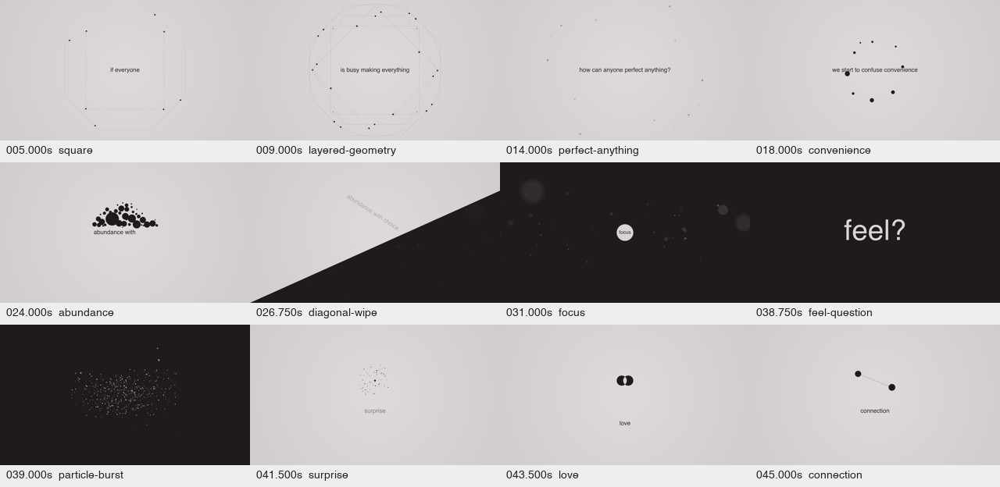
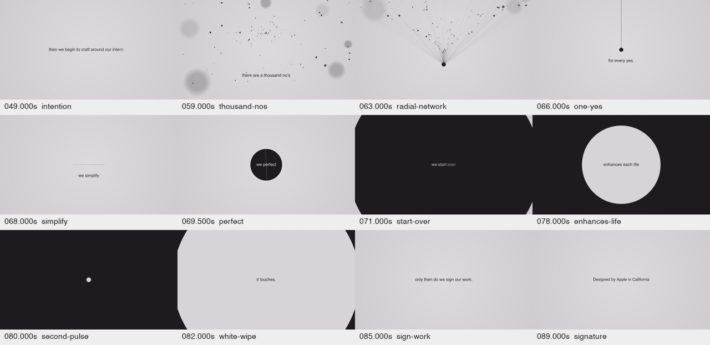

# 网页绘图预览

这里是 `index.html` 的相同绘图代码通过原生 Canvas 绘图库、真实 GSAP 和最小 DOM 接口替身生成的局部预览。SVG 和文字在本地合成用于对照；**这些不是浏览器截图，也不是浏览器交互或性能测试结果**。

文件名的时间码对应参考影片时间。保留 8 张独立关键帧，以及包含全部 24 个最终预览状态的两张联系表。联系表按源时间排序，归档时由最终预览重新生成，未使用较早的草稿联系表。

## 最终绘图联系表

## 精选单帧

| 源时间（秒） | 画面 | 尺寸 |
| --- | --- | --- |
| 5.000 | [square](frames/005.000s-square.png) | 1920×1080 |
| 24.000 | [abundance](frames/024.000s-abundance.png) | 1920×1080 |
| 39.000 | [particle-burst](frames/039.000s-particle-burst.png) | 1920×1080 |
| 43.500 | [love](frames/043.500s-love.png) | 1920×1080 |
| 63.000 | [radial-network](frames/063.000s-radial-network.png) | 1920×1080 |
| 71.000 | [start-over](frames/071.000s-start-over.png) | 1920×1080 |
| 78.000 | [enhances-life](frames/078.000s-enhances-life.png) | 1920×1080 |
| 89.000 | [signature](frames/089.000s-signature.png) | 1920×1080 |

## 验证边界

可据此检查图形结构、关键半径、粒子聚散和源时间对应关系；不能据此断言浏览器字体、CSS 排版、ScrollTrigger pin、滚轮惯性、移动端行为或帧率已通过验收。

[原片参考帧](../../reference/README.md) · [执行文档](../EXECUTION_PLAN.md) · [素材清单](../asset-manifest.json)
